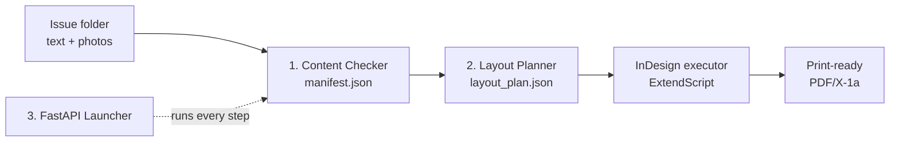

**English** | [Українська](README.uk.md)

# InkForge


**Turns a folder of raw text and photos into a print-ready weekly newspaper, laid out in Adobe InDesign, in a few clicks.**

The layout person keeps full control: InkForge does the repetitive work, and anything can still be fine-tuned by hand afterwards.

## The problem

A small newspaper is laid out by hand every week. Last week's `.indd` file is reused, old text and photos are swapped for new ones one by one, and the PDF is exported for print. It's repetitive, but hard to automate blindly: each of the **3 newspapers** has its own page structure, styles and exceptions, and none of it was documented.

InkForge turns that tribal knowledge into versioned, tested configuration and code.

## How it works



| Level | What it does | Status |
|---|---|---|
| 1. Content Checker | Matches text and photo files, checks word counts and photo DPI/color mode, writes `manifest.json` | ✅ Done |
| 2. Auto-Layout | Python planner + per-newspaper YAML profile → `layout_plan.json`, applied in InDesign by an ExtendScript executor | 🚧 Python side done; InDesign run being verified |
| 3. One-Click Launcher | Local FastAPI app running the whole pipeline, with InDesign driven over Windows COM | 🚧 Pipeline wired; InDesign run being verified |

## Engineering highlights

- **Reverse-engineered IDML**, InDesign's undocumented XML format, from real production files to map paragraph styles to article roles.
- **Config-driven engine**: one shared codebase, one YAML profile per newspaper, no newspaper-specific values hardcoded.
- **Backend driving a desktop app**: a FastAPI service orchestrates InDesign via Windows COM automation.
- **Real geometry debugging**: found that off-page "pasteboard" content was corrupting frame clustering, and fixed it with a strict page-membership check.
- **147 tests**, including ones asserting the COM steps fail gracefully when InDesign isn't installed instead of mocking it away.
- **Shipped in small PRs**, with docs updated alongside the code.

## Quick start

```bash
pip install -e ".[dev]"

inkforge-check  path/to/issue-folder --newspaper <profile_id>   # Level 1
inkforge-plan   path/to/issue-folder/manifest.json --profile <profile_id>   # Level 2

pip install -e ".[launcher]"
inkforge-launcher   # Level 3: local web UI with 4 confirmable steps

pytest
```

## Project layout

```
src/inkforge/
  content_checker/   Level 1
  layout_engine/     Level 2 (Python planner)
  launcher/          Level 3 (FastAPI)
extendscript/        Level 2 (InDesign executor)
profiles/            one YAML profile per newspaper
docs/                requirements, architecture, conventions (Ukrainian)
tests/               pytest suite
```

## Documentation

The detailed docs are in Ukrainian, the working language of the end user:
[requirements](docs/requirements.md) · [architecture](docs/architecture.md) · [content structure](docs/content-structure.md) · [first-run checklist](docs/first-run-checklist.md) · [extendscript notes](extendscript/README.md)

To update the end user's machine, double-click [`scripts/update_and_run.bat`](scripts/update_and_run.bat). It runs `git pull` in an existing clone and needs Git for Windows.

## License

[MIT](LICENSE)
