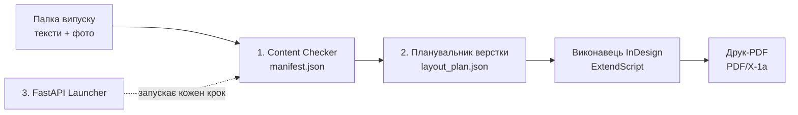

[English](README.md) | **Українська**

# InkForge


**Перетворює папку з текстами й фото на готову до друку щотижневу газету, зверстану в Adobe InDesign, у кілька кліків.**

Верстальниця зберігає повний контроль: InkForge бере на себе рутину, а все інше можна доопрацювати вручну після автоматичної верстки.

## Проблема

Невелику газету щотижня верстають вручну: беруть `.indd` минулого випуску, по одному замінюють старі тексти й фото на нові та експортують PDF для друку. Це рутина, але її складно автоматизувати наосліп: кожна з **3 газет** має власну структуру сторінок, стилі та винятки, і все це ніде не було задокументовано.

InkForge перетворює ці неписані знання на версіоновану, покриту тестами конфігурацію та код.

## Як це працює



| Рівень | Що робить | Статус |
|---|---|---|
| 1. Content Checker | Зіставляє тексти й фото, перевіряє обсяг тексту та DPI/колірний режим фото, формує `manifest.json` | ✅ Готово |
| 2. Автоверстка | Python-планувальник + YAML-профіль газети → `layout_plan.json`, який застосовує в InDesign ExtendScript-виконавець | 🚧 Python-частина готова; запуск в InDesign перевіряється |
| 3. One-Click Launcher | Локальний FastAPI-застосунок, що запускає весь ланцюжок і керує InDesign через Windows COM | 🚧 Ланцюжок зібрано; запуск в InDesign перевіряється |

## Інженерні особливості

- **Розібраний IDML**, недокументований XML-формат InDesign: на реальних робочих файлах зіставлено стилі абзаців із ролями в статті.
- **Рушій на конфігурації**: одна спільна кодова база, один YAML-профіль на газету, жодних значень конкретної газети в коді.
- **Бекенд керує десктопною програмою**: FastAPI-сервіс керує InDesign через Windows COM.
- **Налагодження реальної геометрії**: вміст поза сторінкою (монтажний стіл) псував групування фреймів; виправлено суворою перевіркою належності до сторінки.
- **147 тестів**, зокрема такі, що перевіряють коректну відмову COM-кроків без встановленого InDesign, а не просто підміняють його моками.
- **Невеликі PR**, документація оновлюється разом із кодом.

## Швидкий старт

**Windows, без командного рядка:** один раз двічі клацніть `setup.bat`, далі щоразу — `start_launcher.bat`.

**Або вручну:**

```bash
pip install -e ".[dev]"

inkforge-check  path/to/issue-folder --newspaper <profile_id>   # Рівень 1
inkforge-plan   path/to/issue-folder/manifest.json --profile <profile_id>   # Рівень 2

pip install -e ".[launcher]"
inkforge-launcher   # Рівень 3: локальний веб-інтерфейс із 4 кроками з підтвердженням

pytest
```

Лаунчер відкривається за адресою `http://127.0.0.1:8765`.

## Структура репозиторію

```
src/inkforge/
  content_checker/   Рівень 1
  layout_engine/     Рівень 2 (Python-планувальник)
  launcher/          Рівень 3 (FastAPI)
extendscript/        Рівень 2 (виконавець для InDesign)
profiles/            один YAML-профіль на газету
docs/                вимоги, архітектура, конвенції
tests/               pytest-тести
```

## Документація

[вимоги](docs/requirements.md) · [архітектура](docs/architecture.md) · [структура контенту](docs/content-structure.md) · [чек-лист першого запуску](docs/first-run-checklist.md) · [нотатки щодо ExtendScript](extendscript/README.md)

Щоб оновити проєкт на комп'ютері верстальниці, двічі клацніть [`scripts/update_and_run.bat`](scripts/update_and_run.bat). Він виконує `git pull` в уже клонованій папці проєкту; потрібен [Git for Windows](https://git-scm.com/download/win).

## Ліцензія

[MIT](LICENSE)